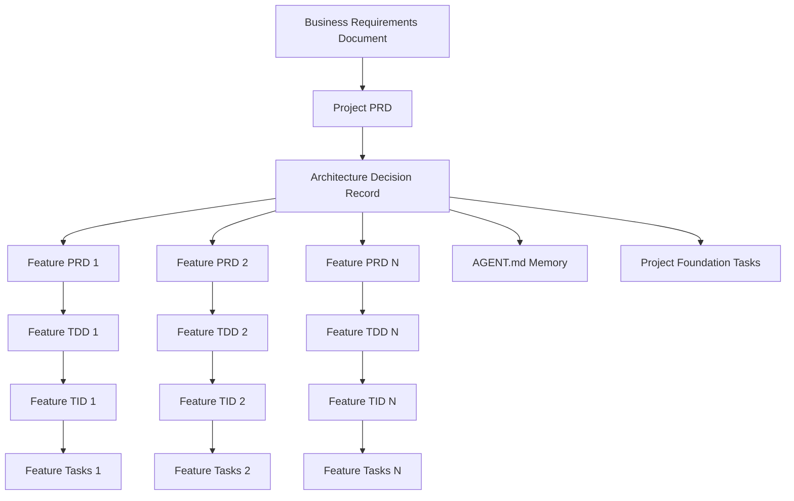

# AI Dev Tasks Framework

## Table of Contents
- [Overview](#overview)
- [Philosophy & Background](#philosophy--background)
- [Framework Architecture](#framework-architecture)
- [Instruction Documents](#instruction-documents)
- [Workflow Implementation](#workflow-implementation)
- [Context Management](#context-management)
- [Getting Started](#getting-started)
- [Best Practices](#best-practices)
- [Troubleshooting](#troubleshooting)

## Overview

The **AI Dev Tasks Framework** is a comprehensive methodology for AI-assisted software development that transforms high-level project ideas into detailed, actionable development tasks through a structured documentation workflow. This framework enables junior developers to build complex software projects systematically while maintaining consistency, quality, and clear progress tracking.

### What This Framework Does

- **Transforms Ideas → Code:** Converts abstract project concepts into concrete implementation tasks
- **Ensures Consistency:** Establishes technical standards that apply across all features
- **Enables Collaboration:** Creates clear documentation that any team member can follow
- **Supports Iteration:** Allows for pause/resume development across multiple sessions
- **Maintains Quality:** Built-in testing and review processes at every level

### Target Audience

- **Junior Developers** seeking structured guidance for complex projects
- **Development Teams** wanting consistent documentation and architecture standards
- **Project Managers** needing clear visibility into development progress
- **Technical Writers** documenting software development processes

## Philosophy & Background

### The Problem

Traditional software development often suffers from:
- **Inconsistent Architecture:** Different developers make conflicting technical decisions
- **Poor Documentation:** Features built without clear requirements or design docs
- **Context Loss:** Development stalls when team members switch or take breaks
- **Quality Issues:** Missing tests, inconsistent patterns, technical debt accumulation
- **Junior Developer Challenges:** Overwhelming complexity without clear guidance

### The Solution

This framework addresses these challenges through:

1. **Front-Loaded Planning:** All major decisions made before coding begins
2. **Layered Documentation:** Progressive detail from business goals to implementation tasks
3. **Standardized Processes:** Consistent approach for every feature and component
4. **Memory Systems:** Context preservation across sessions and team members
5. **Quality Gates:** Built-in review and testing requirements at each stage

### Core Principles

- **Documentation-First Development:** Think before you build
- **Progressive Elaboration:** Start broad, get specific incrementally  
- **Consistency Over Creativity:** Standardized approaches reduce cognitive load
- **Context Preservation:** Work should be resumable by anyone, anytime
- **Quality by Design:** Testing and review built into the process, not added later

## Framework Architecture

The framework follows a hierarchical structure that mirrors how humans naturally think about software projects:

```
Business Requirements (Raw Input Level)
    ↓
Business Vision (Project Level)
    ↓
Technical Foundation (Architecture Level)  
    ↓
Feature Requirements (Product Level)
    ↓
Technical Design (System Level)
    ↓
Implementation Details (Code Level)
    ↓
Actionable Tasks (Development Level)
```

### Document Types & Relationships



## Instruction Documents

This section details each instruction document's purpose, approach, inputs, and outputs.

### 1. `001_generate-brd.md`

**Purpose:** Converts a free-form transcript plus supporting research/documents into a structured Business Requirements Document (BRD) — the first step of the whole workflow, run once per project right after cloning the template

**Philosophy:** Capture the "why" from raw, unstructured input before any structured planning begins

**Process:**
- Takes a free-form transcript (e.g. speech-to-text) plus any other informing material (research, notes, existing specs)
- Asks grouped clarifying questions (scope, users, timeline, success metrics, integrations, risks) before writing anything
- Generates a BRD in a fixed YAML schema once questions are answered

**Inputs:**
- Free-form project transcript
- Supporting documents (research, notes, existing requirements)
- Answers to clarifying questions

**Outputs:**
- `000_BRD|[project-name].md` in `0xcc/prds/` folder
- Structured business context consumed directly by `002_create-project-prd.md`

**Key Questions Addressed:**
- What is this project for, in the requester's own words?
- What business requirements and constraints already exist?
- What's still unknown or needs clarification before planning starts?

---

### 2. `002_create-project-prd.md`

**Purpose:** Creates the foundational project vision and feature breakdown

**Philosophy:** Establish the "why" and "what" before diving into "how"

**Process:**
- Gathers high-level project requirements through strategic questioning
- Defines target users, success criteria, and business objectives
- Breaks project into logical features with priority levels
- Sets scope boundaries and future roadmap considerations

**Inputs:**
- Project description from stakeholder/product owner
- Answers to strategic clarifying questions about scope, users, timeline, success metrics

**Outputs:**
- `000_PPRD|[project-name].md` in `/prds/` folder
- High-level feature list for subsequent detailed specification
- Business context for all technical decisions

**Key Questions Addressed:**
- What problem does this project solve?
- Who are the users and what do they need?
- How will we measure success?
- What's in scope vs. out of scope?

---

### 3. `003_create-adr.md`

**Purpose:** Establishes foundational technology choices and development standards

**Philosophy:** Make architectural decisions once, apply them consistently

**Process:**
- Analyzes project requirements from Project PRD
- Presents technology options with trade-offs for each decision area
- Creates comprehensive standards for code organization, testing, and quality
- Generates memory content for AI context in AGENT.md

**Inputs:**
- Project PRD reference for context and requirements
- User decisions on technology stack choices
- Answers to technical evaluation questions

**Outputs:**
- `000_PADR|[project-name].md` in `/adrs/` folder (full documentation)
- Project Standards section for AGENT.md (condensed memory)
- Technology stack decisions and architectural principles

**Technology Decision Areas:**
- Frontend/Backend frameworks
- Database and data management
- API design patterns
- Authentication and security
- Testing strategies
- Deployment approaches
- Development principles and tooling

---

### 4. `004_create-feature-prd.md`

**Purpose:** Creates detailed requirements for individual features

**Philosophy:** Translate business goals into implementable feature specifications

**Process:**
- References Project PRD and ADR for context and constraints
- Gathers feature-specific requirements through targeted questioning
- Defines user stories, acceptance criteria, and technical requirements
- Establishes feature boundaries and integration needs

**Inputs:**
- Feature selection from Project PRD feature breakdown
- Project PRD and ADR for context and standards
- Answers to feature-specific clarifying questions

**Outputs:**
- `[###]_FPRD|[feature-name].md` in `/prds/` folder
- Detailed functional and non-functional requirements
- User stories with acceptance criteria
- Integration specifications and dependencies

**Key Sections:**
- User stories and scenarios
- Functional requirements (numbered list)
- Technical constraints from ADR
- API/integration specifications
- Testing requirements

---

### 5. `005_create-tdd.md`

**Purpose:** Creates technical architecture and design for features

**Philosophy:** Bridge business requirements with implementation approach

**Process:**
- Analyzes Feature PRD for technical requirements
- Assesses current codebase patterns and architecture
- Makes high-level design decisions for the feature
- Provides architectural guidance without implementation details

**Inputs:**
- Feature PRD reference for requirements
- Existing codebase assessment
- Answers to technical design questions

**Outputs:**
- `[###]_FTDD|[feature-name].md` in `/tdds/` folder
- System architecture and component relationships
- Data design and API patterns
- Performance and security considerations
- Testing strategy and approach

**Design Areas:**
- Component architecture and relationships
- Data design patterns and validation strategy
- API design patterns and conventions
- State management approach
- Security and performance principles
- Testing philosophy and coverage strategy

---

### 6. `006_create-tid.md`

**Purpose:** Provides specific implementation guidance and coding hints

**Philosophy:** Translate design decisions into actionable implementation guidance

**Process:**
- Synthesizes Feature PRD and TDD requirements
- Performs deep analysis of existing codebase patterns
- Provides specific coding hints and implementation strategies
- Sets up direct input for task generation

**Inputs:**
- Feature PRD and TDD references
- Comprehensive codebase analysis
- Answers to implementation-specific questions

**Outputs:**
- `[###]_FTID|[feature-name].md` in `/tids/` folder
- File organization and naming patterns
- Component implementation hints and patterns
- Database and API implementation strategies
- Testing and quality guidelines

**Implementation Areas:**
- File structure and organization patterns
- Component design patterns and abstraction levels
- Database implementation approach and optimization hints
- API implementation strategy and error handling patterns
- Testing implementation approach and coverage strategy
- Code quality standards and review guidelines

---

### 7. `007_generate-tasks.md`

**Purpose:** Generates the feature's complete task backlog — every requirement, acceptance criterion, edge case, and technical concern maps to a task

**Philosophy:** A backlog is complete when nothing is silently omitted — every category of work either produces tasks or is explicitly marked N/A with a reason

**Process:**
- Analyzes the Feature PRD, TDD, and TID together (all three required)
- Creates hierarchical task structure scaled to feature complexity, with parent tasks citing the requirement numbers they cover
- Applies a category checklist (data, API, UI, integration, error handling, testing, performance/security, config/deploy, docs)
- Converts open questions to spike tasks, derives cross-feature integration tasks, and ends with a Feature Acceptance parent task
- Runs a coverage audit before saving: no uncovered requirement, criterion, or TDD/TID section

**Inputs:**
- Feature PRD, TDD, and TID references (TDD/TID required — they carry the migration, deployment, config, and error-handling work the PRD alone does not)
- Project ADR for standards and test commands
- User confirmation to proceed from parent tasks to sub-tasks

**Outputs:**
- `[###]_FTASKS|[feature-name].md` in `/tasks/` folder
- Once per project: `000_FTASKS|Project_Foundation.md` — the foundation backlog generated from the Project PRD + ADR (scaffolding, CI/CD, database, auth, tooling)

**Task Structure:**
- Parent tasks citing covered requirement numbers
- Sub-tasks sized at roughly one commit each
- Implementing and testing sub-tasks for every acceptance criterion and edge case
- Category Checklist Results section (tasks or N/A-with-reason per category)
- Final Feature Acceptance parent task

---

### 8. `008_process-task-list.md`

**Purpose:** Guides task execution and progress tracking

**Philosophy:** Systematic implementation with quality gates and progress tracking

**Process:**
- Defines task completion protocols and quality gates
- Establishes git workflow for progress tracking
- Sets up testing and review requirements
- Ensures proper documentation of completed work

**Key Protocols:**
- One sub-task at a time with user permission for next
- Testing required before marking parent tasks complete
- Git commits with conventional commit format
- Progress tracking in task list file
- File maintenance for "Relevant Files" section
- Feature Acceptance protocol at the end: verify every PRD acceptance criterion, run the full suite, mark the feature ✅ in AGENT.md's Document Inventory, and route discovered work to the right backlog

## Workflow Implementation

### Phase-by-Phase Workflow

#### Phase 0: Business Requirements (once per project)
```bash
# Clone template, rm -rf .git, rename root, git init
@0xcc/instruct/001_generate-brd.md
# Provide: free-form transcript + supporting research/documents
# Generate: 000_BRD|[project-name].md
```

#### Phase 1: Project Foundation (Session 1-2)
```bash
# Session 1: Project Vision
@0xcc/instruct/002_create-project-prd.md
@0xcc/prds/000_BRD|[project-name].md   # if it exists
# Generate: 000_PPRD|[project-name].md

# Session 2: Technical Foundation  
@0xcc/instruct/003_create-adr.md
@0xcc/prds/000_PPRD|[project-name].md
# Generate: 000_PADR|[project-name].md
# Copy Project Standards to AGENT.md

# Session 3: Foundation Backlog
@0xcc/instruct/007_generate-tasks.md
@0xcc/prds/000_PPRD|[project-name].md
@0xcc/adrs/000_PADR|[project-name].md
# Generate: 000_FTASKS|Project_Foundation.md
# (scaffolding, CI/CD, database, auth, tooling — work owned by no single feature)
```

#### Phase 2: Feature Development (Sessions 3-N)
For each feature from the Project PRD:

```bash
# Feature Requirements Session
@0xcc/instruct/004_create-feature-prd.md
@0xcc/prds/000_PPRD|[project-name].md
@0xcc/adrs/000_PADR|[project-name].md
# Generate: 001_FPRD|[feature-name].md

# Technical Design Session
@0xcc/instruct/005_create-tdd.md
@0xcc/prds/001_FPRD|[feature-name].md
# Generate: 001_FTDD|[feature-name].md

# Implementation Planning Session
@0xcc/instruct/006_create-tid.md
@0xcc/prds/001_FPRD|[feature-name].md
@0xcc/tdds/001_FTDD|[feature-name].md
# Generate: 001_FTID|[feature-name].md

# Task Generation Session
@0xcc/instruct/007_generate-tasks.md
@0xcc/prds/001_FPRD|[feature-name].md
@0xcc/tdds/001_FTDD|[feature-name].md
@0xcc/tids/001_FTID|[feature-name].md
# Generate: 001_FTASKS|[feature-name].md

# Implementation Sessions
@0xcc/instruct/008_process-task-list.md
@0xcc/tasks/001_FTASKS|[feature-name].md
# Execute tasks with progress tracking
```

### File Structure Layout

```
project-root/
├── AGENT.md                                     # Project memory and standards (canonical)
├── CLAUDE.md                                    # Stub → @AGENT.md
├── GEMINI.md                                    # Stub → @AGENT.md
└── 0xcc/
    ├── prds/
    │   ├── 000_BRD|Project_Name.md              # Business Requirements Document
    │   ├── 000_PPRD|Project_Name.md             # Project PRD
    │   ├── 001_FPRD|Feature_A.md                # Feature PRDs
    │   ├── 002_FPRD|Feature_B.md
    │   └── 003_FPRD|Feature_C.md
    ├── adrs/
    │   └── 000_PADR|Project_Name.md             # Architecture Decision Record
    ├── tdds/
    │   ├── 001_FTDD|Feature_A.md                # Technical Design Documents
    │   ├── 002_FTDD|Feature_B.md
    │   └── 003_FTDD|Feature_C.md
    ├── tids/
    │   ├── 001_FTID|Feature_A.md                # Technical Implementation Documents
    │   ├── 002_FTID|Feature_B.md
    │   └── 003_FTID|Feature_C.md
    ├── tasks/
    │   ├── 000_FTASKS|Project_Foundation.md     # Foundation backlog (from PPRD + ADR)
    │   ├── 001_FTASKS|Feature_A.md              # Feature Task Lists
    │   ├── 002_FTASKS|Feature_B.md
    │   └── 003_FTASKS|Feature_C.md
    ├── docs/
    │   └── [Additional project documentation]
    └── instruct/
        ├── 000_README.md                        # This document
        ├── 001_generate-brd.md
        ├── 002_create-project-prd.md
        ├── 003_create-adr.md
        ├── 004_create-feature-prd.md
        ├── 005_create-tdd.md
        ├── 006_create-tid.md
        ├── 007_generate-tasks.md
        └── 008_process-task-list.md
```

## Context Management

### AGENT.md as Project Memory

AGENT.md is the single file that carries project state between sessions — no separate session-state files or checkpoint system needed:

```markdown
# Project: [Your Project Name]

## Current Status
- **Phase:** [Current development phase]
- **Next Steps:** [Specific next actions]
- **Active Document:** [Document currently being worked on]

## Project Standards
[Auto-generated from ADR - technology stack, coding patterns, architecture principles]

## Document Inventory
### Completed Documents
- ✅ 000_PPRD|Project_Name.md
- ✅ 000_PADR|Project_Name.md
- ✅ 001_FPRD|Feature_A.md
- ⏳ 001_FTDD|Feature_A.md (in progress)
- ❌ 001_FTID|Feature_A.md (pending)

### Feature Priority Order
1. Feature A (Core/MVP)
2. Feature B (Important)  
3. Feature C (Future)
```

To resume work in a new session, load `@AGENT.md` and check the Document Inventory to see what's done and what's pending — that's sufficient context to continue. Claude Code's own conversation history and `/compact` handle everything else.

### Document Status Tracking
- **✅ Complete:** Document finished and reviewed
- **⏳ In Progress:** Currently being worked on  
- **❌ Pending:** Not yet started
- **🔄 Needs Update:** Requires revision based on changes

### Git Workflow Integration
```bash
# Feature branch for documentation phase
git checkout -b docs/feature-planning

# Regular commits with conventional commit format
git commit -m "docs(prd): complete user authentication feature requirements"
git commit -m "docs(tdd): define authentication component architecture"  
git commit -m "docs(tid): specify JWT implementation patterns"
git commit -m "docs(tasks): create authentication task breakdown"

# Merge when feature documentation complete
git checkout main
git merge docs/feature-planning
```

## Getting Started

### Prerequisites

- **Claude Code CLI** installed and configured
- **Git** for version control and progress tracking
- **Text Editor** with Markdown support (VS Code recommended)
- **Basic understanding** of software development concepts

### Quick Start Guide

#### Step 1: Create Your Project from the Template
```bash
# On GitHub: open hitsainet/xcc_open and click "Use this template",
# then clone your new repository:
git clone https://github.com/yourusername/your-project-name.git
cd your-project-name

# (Alternative: clone the template directly, rm -rf .git, and git init —
# see the root README.md "Step-by-Step Setup" for the full manual flow)
```

#### Step 2: Verify Framework Files
```bash
ls 0xcc/instruct/
# Should show: 000_README.md through 008_process-task-list.md
```

#### Step 3: Start Documentation Workflow
```bash
# Start a Claude Code session, then:
# Begin with the BRD (once per project), then the Project PRD
@0xcc/instruct/001_generate-brd.md
@0xcc/instruct/002_create-project-prd.md

# Follow the guided process...
```

### Sample Timeline

**Week 1: Foundation**
- Day 1-2: Project PRD and ADR creation
- Day 3-4: AGENT.md setup and first feature PRD

**Week 2-N: Feature Development**
- 2-3 days per feature for complete documentation cycle
- PRD → TDD → TID → Tasks for each feature
- Adjust timeline based on feature complexity

### Success Metrics

You'll know the framework is working when:
- **Context Resumes Smoothly:** Any team member can pick up work after breaks
- **Decisions Are Consistent:** All features follow established patterns
- **Quality Is Built-In:** Testing and review requirements are clear
- **Progress Is Visible:** Anyone can see project status at a glance
- **Implementation Is Smooth:** Developers have clear, actionable tasks

## Best Practices

### Documentation Quality

1. **Be Specific, Not Generic**
   - ❌ "Add user management"
   - ✅ "Create user registration form with email validation, password strength requirements, and email confirmation workflow"

2. **Reference Context Explicitly**
   - Always reference related documents: `@0xcc/prds/000_PPRD|Project_Name.md`
   - Link to ADR decisions: "Following JWT approach per ADR section 2.3"

3. **Update Status Religiously**
   - Update AGENT.md after every session
   - Use consistent status indicators (✅⏳❌🔄)
   - Include specific next steps, not vague intentions

### Session Management

1. **Start Sessions by Loading Context:** `@AGENT.md`, then check the Document Inventory for what's pending
2. **Break Work into Session-Sized Chunks:** single document per session ideally; complex documents can span 2-3 sessions max; end at logical stopping points

### Quality Gates

1. **Don't Skip Steps**
   - Every feature needs PRD → TDD → TID → Tasks progression
   - Each step validates and builds on the previous
   - Shortcuts lead to inconsistency and rework

2. **Review Before Proceeding**
   - Review each document before starting the next
   - Check alignment with ADR standards
   - Validate against Project PRD goals

3. **Test the Documentation**
   - Can a junior developer follow your tasks?
   - Are all dependencies clearly identified?
   - Is the acceptance criteria measurable?

## Troubleshooting

### Common Issues and Solutions

#### "I Lost Context Between Sessions"
**Solution:** Reload the core project files
```bash
@AGENT.md                           # Project memory and Document Inventory
@0xcc/prds/000_PPRD|[project-name].md     # Project foundation  
@0xcc/adrs/000_PADR|[project-name].md     # Technical standards
ls -la */                           # Check completion status
```

#### "The Tasks Don't Match the Requirements"
**Solution:** Check the document chain
1. Verify TID references correct PRD and TDD
2. Ensure TDD addresses all PRD requirements  
3. Confirm ADR standards are being followed
4. Regenerate tasks with proper context

#### "Documents Are Inconsistent"
**Solution:** ADR standards not being followed
1. Review ADR and update AGENT.md if needed
2. Check that each document references ADR decisions
3. Update inconsistent documents to match standards
4. Add ADR references to instruction prompts

#### "Progress Tracking Is Confusing"
**Solution:** Improve AGENT.md maintenance
1. Use consistent status indicators (✅⏳❌🔄)
2. Keep the Document Inventory current as documents are completed
3. Include specific next steps, not vague goals
4. Reference exact document names and numbers

#### "Tasks Are Too Vague or Too Detailed"
**Solution:** Adjust TID implementation hints
- Too vague: Add more specific implementation patterns to TID
- Too detailed: Focus TID on patterns and approaches, not exact code
- Inconsistent: Review instruction documents for clarity

### Getting Help

1. **Review Instruction Documents:** Each has specific guidance for its phase
2. **Check AGENT.md:** Verify project standards are properly loaded
3. **Validate Document Chain:** Ensure each document builds properly on previous ones

---

## Conclusion

The AI Dev Tasks Framework transforms chaotic software development into a systematic, repeatable process. By front-loading planning and maintaining consistent documentation standards, teams can build complex software with confidence, clarity, and quality.

The framework's strength lies not just in its structured approach, but in its memory systems that enable seamless collaboration and context preservation. Whether you're a junior developer tackling your first major project or an experienced team seeking better consistency, this framework provides the scaffolding for successful software development.

Remember: **Think first, then build.** The time invested in proper documentation and planning pays dividends throughout the development lifecycle and beyond.

---

*Framework Version: 1.2*  
*Last Updated: 2026-07-05*  
*License: MIT*