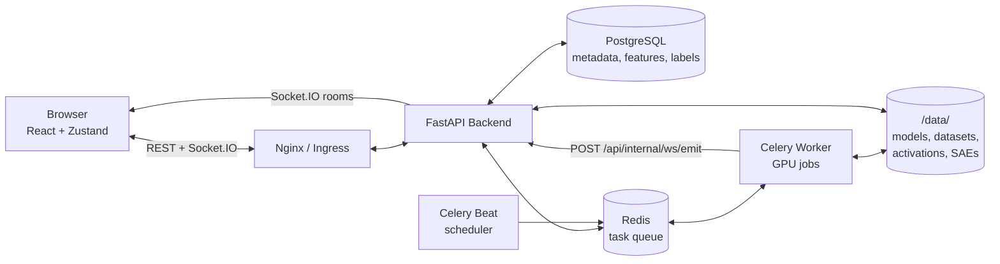

# System Architecture

miStudio is a job-oriented system: the browser configures work, background workers execute it on the GPU, and progress streams back in real time. Understanding this shape explains most of the app's behavior — why jobs survive browser refreshes, why there are two kinds of processes to check when something stalls, and where your data actually lives.

## Service Topology

| Service | Role |
|---------|------|
| **React frontend** | All UI. State in Zustand stores; one store per domain (datasets, trainings, features…) |
| **FastAPI backend** | REST API (~100 endpoints), WebSocket hub (Socket.IO), request validation, DB access |
| **Celery worker** | Executes every long-running job: downloads, tokenization, training, extraction, labeling, steering, exports |
| **Celery Beat** | Scheduler — emits system metrics every 2s, runs the GPU watchdog |
| **Redis** | Task queue between API and workers |
| **PostgreSQL** | All metadata: models, datasets, trainings, features, labels, settings (JSONB for flexible configs) |
| **`/data/` filesystem** | The heavy bytes: model weights, raw + tokenized datasets, cached activations, SAE weights, export ZIPs |

## The Job Lifecycle

Every heavy operation follows the same pattern:

1. **POST** to a REST endpoint creates a database record (status `queued`) and enqueues a Celery task; the API returns immediately
2. The **worker** picks up the task, updates the record's status/progress as it runs, and emits progress events
3. The **frontend** subscribes to the job's WebSocket channel and updates the UI live
4. On completion/failure, the record holds the final state — jobs are inspectable and retryable after the fact

This is why closing your browser never cancels work, and why every panel can reconstruct in-flight state from the database on page load.

## WebSocket-First Real-Time Updates

Workers are separate processes and can't push to browser sockets directly. Instead:

- Workers POST progress to an internal backend endpoint (`/api/internal/ws/emit`)
- The backend relays it into a **Socket.IO room** named for the job (e.g., `trainings/{id}/progress`)
- Events are namespaced `entity:event` (e.g., `training:progress`, `extraction:completed`)

The frontend subscribes per-channel with React hooks, and every store implements **automatic polling fallback**: if the WebSocket drops, the UI switches to HTTP polling, then back when the socket reconnects. The full channel catalog is in the [WebSocket reference](/reference/websocket-channels).

## GPU Discipline

GPU work is serialized through the worker and guarded:

- Extraction jobs accept a **`gpu_id`** to target a specific device on multi-GPU hosts
- Steering runs in an isolated subprocess so a crash can't take the worker down
- A **watchdog task** (Celery Beat) detects zombie processes holding VRAM and cleans them up

See [Multi-GPU Support](/advanced/multi-gpu) for what's implemented versus planned.

## Runtime Serving: Multi-SAE Attach

miStudio *discovers and calibrates* — it runs the model to learn. A separate plane, **miLLM**, *serves* — it runs the model behind an OpenAI-compatible API with SAEs attached at inference time. The boundary between them is a portable document (a circuit or cluster definition), not a code dependency.

On the serving side, **multiple SAEs attach concurrently** — one is not resident at a time. Since Feature 12, miLLM's `attach_set()` loads a set of referenced SAEs (fp16) and installs one hook per `(sae_id, layer)`, so a single request can be steered across several layers at once:

- **`GET /api/saes/attachments`** — the plural attachment status: every attached `(sae_id, layer)` entry, plus total VRAM against the multi-SAE envelope
- **`POST /api/saes/attach-set`** — attach a set of SAEs for cross-layer circuit serving; idempotent per `(sae_id, layer)` key

This is what makes **circuit** and **cluster** serving possible: a circuit spans features across multiple layers, so serving it means attaching every SAE the circuit touches, not just one. A cluster (a named, tuned group of features with a strength budget) serves the same way. A calibrated circuit exported from miStudio carries its usable-band into miLLM, where activating it attaches the right SAEs and applies the tuned intensity.

## Deployment Shapes

The same containers run in two configurations:

- **Docker Compose** — nginx + backend + frontend + postgres + redis + worker + beat; the standard single-host setup ([guide](/getting-started/install-guide-compose))
- **Kubernetes** — the same services as a deployment manifest with GPU node scheduling ([guide](/getting-started/install-guide-k8s))

Database migrations run automatically at backend startup (`alembic upgrade heads`), so upgrading is: pull new images, restart.
