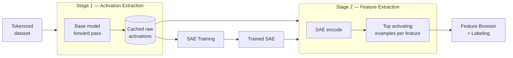

# The Extraction Pipeline

"Extraction" appears twice in miStudio's UI, meaning two different things. This page disambiguates them once and for all — it's the single most common point of confusion for new users.

## Stage 1: Activation Extraction (Models panel)

**What runs:** the *base model*.
**Input:** a tokenized dataset.
**Output:** the model's raw internal activations at your chosen layer(s) and hook point(s), cached to disk.

This is the expensive stage — it's a full forward pass of the base model over potentially millions of tokens. You configure it from the **Models** panel (layer, hook type, batch size, and optionally a `gpu_id` on multi-GPU hosts).

The cache is reusable: SAE training consumes it, and re-training with different hyperparameters against the same cache costs nothing extra — see [Multi-Dataset Training](/advanced/multi-dataset).

## Stage 2: Feature Extraction (SAEs panel)

**What runs:** a *trained SAE* (cheap — it's a two-layer network).
**Input:** activations (recomputed or cached).
**Output:** for every SAE feature, its top activating dataset examples — the text snippets where that feature fires hardest, with per-token activation values.

You launch it from an SAE card in the **SAEs** panel. The results populate the **Feature Browser**, and are the evidence base for [labeling](/core-workflow/auto-labeling) and the starting point for [steering](/core-workflow/steering).

## Side by Side

| | Stage 1: Activation extraction | Stage 2: Feature extraction |
|---|---|---|
| Panel | Models | SAEs |
| Runs | Base model (heavy, GPU-bound) | Trained SAE (light) |
| Produces | Raw activation tensors on disk | Feature records in the database |
| Consumed by | SAE training, Stage 2 | Feature Browser, labeling, steering |
| Typical duration | Minutes–hours | Minutes |

**Rule of thumb:** if the job needed the *base model*, it was Stage 1. If it needed a *trained SAE*, it was Stage 2.
